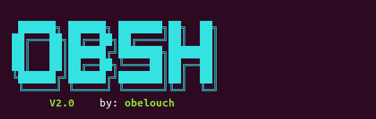
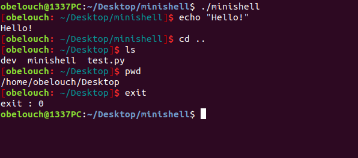

# MiniShell

Recoding my own little bash. A program capable of parsing a prompt and launching executables with arguments, along with a few built-in functions.

## Compile
- Run `make`

## Execute
- `./minishell`

## Owner
- Oussama Belouche 1337

